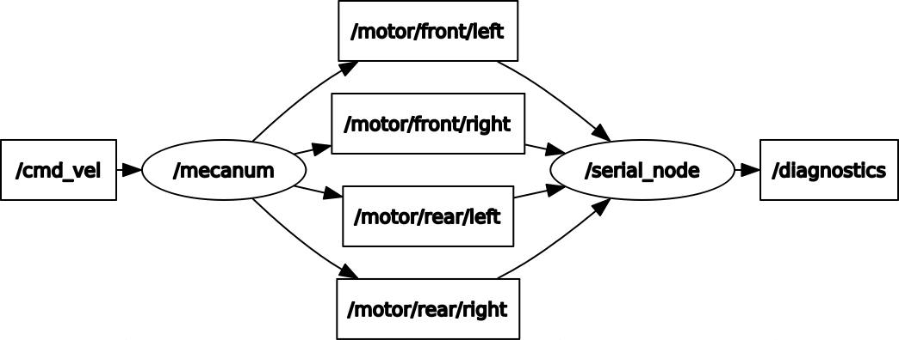

# XRLab Rover Arduino code -- version3.0
## Introduction

In this version we accomplish the communication from ROS to Arduino. Receive 4 rostopic /motor/front/left, /motor/front/right, /motor/rear/left, /motor/rear/right, to control each wheel's speed through PID control.
## ROS Arduino Basic Structure
```c++
#include <ros.h>
#include <std_msgs/Float32.h>

void callback(const std_msgs::Float32 &msg){
  float aim = msg.data;
}
ros::NodeHandle nh;
ros::Subscriber<std_msgs::Float32> sub("motor/front/left", &motor_aima);

void setup(){
    nh.initNode();
    nh.subscribe(sub);
}

void loop(){
    nh.spinOnce();
}
```
## [XRLab_mecanum.zip](../XRLab_mecanum.zip) is an own Arduino library containing 4 part:
### [encoder.h](../XRLab_mecanum/encoder.h)
Rotation will cause the square wave received by the encoder to change, and send it back through the special pins (mega: 2, 3, 18, 19) to trigger the attachInterrupt function on the mega board to count.


"encoder_a" is used for the interrupt pin, not both a and b are used, resulting in a decrease in resolution (Limited by Mega's digital pins with interrupts, only 6 of them). The function is triggered only when A has a high and low change.
1. A : H -> L;  B = L;  count
2. A : stable;  unable to count
3. A : L -> H;  B = H;  count
4. A : stable;  unable to count
### [motor.h](../XRLab_mecanum/motor.h)

### [mecanum.h](../XRLab_mecanum/mecanum.h)

### [mecanumpid.h](../XRLab_mecanum/mecanumpid.h)
