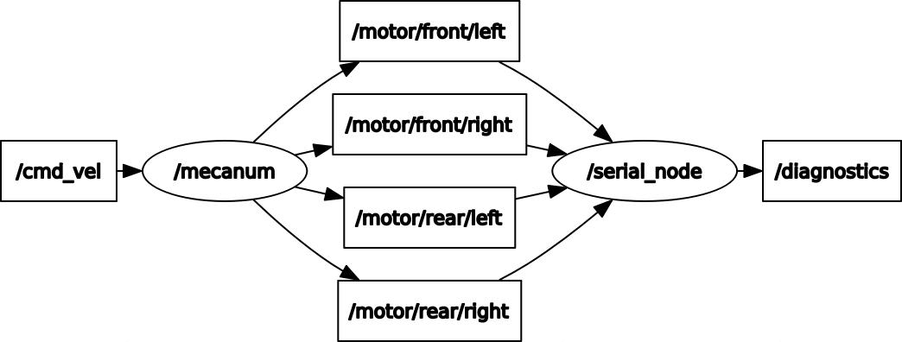

# XRLab Rover Arduino code -- version3.0
## Introduction

In this version we accomplish the communication from ROS to Arduino. Receive 4 rostopic /motor/front/left, /motor/front/right, /motor/rear/left, /motor/rear/right, to control each wheel's speed through PID control.
## ROS Arduino Basic Structure
```c++
#include <ros.h>
#include <std_msgs/Float32.h>

void callback(const std_msgs::Float32 &msg){
  float aim = msg.data;
}
ros::NodeHandle nh;
ros::Subscriber<std_msgs::Float32> sub("motor/front/left", &motor_aima);

void setup(){
    nh.initNode();
    nh.subscribe(sub);
}

void loop(){
    nh.spinOnce();
}
```
## [XRLab_mecanum.zip](../XRLab_mecanum.zip) is an own Arduino library containing 4 part:
### encoder.h
```c++
#ifndef ENCODER_H
#define ENCODER_H
#include "Arduino.h"
typedef struct ENCODER
{
    char encoder_a;
    char encoder_b;
    volatile int count;
    volatile int last_count;
    volatile int cmd_vel; // (mm/s)
} ENCODERDEF;

extern ENCODERDEF ENCODER_1, ENCODER_2, ENCODER_3, ENCODER_4;
extern void Encoder_Init(void);
void Encoder_1_Count(void);
void Encoder_2_Count(void);
void Encoder_3_Count(void);
void Encoder_4_Count(void);

#endif
```
### motor.h
```c++
#ifndef MOTOR_H
#define MOTOR_H
#include "Arduino.h"
#define REDUCTION_RATIO 1100  
// 50*11*2(interupt於A，其方波high、low變化紀錄一次脈衝,因此2倍)  
// 11(電機編碼器基礎脈衝數：11PPR) * 2 * 50(減速比為1:50 = 輸入轉速:輸出轉速)
#define WHEEL 239.3           // 輪子周常 (mm)

typedef struct MOTOR
{
  int pwm_pin;
  int dir1_pin;
  int dir2_pin;
  volatile int aim_pwm;
  volatile int current_error;
  volatile int last_error;
  volatile int previous_error;
  volatile float pwm_out;
  int sum_count;         // 脈衝個數
  float real_circle;     // 實際的圈數
  float caculate_circle; // 计算的圈数
  int average_speed;     // 平均速度
} MOTORDEF;

extern MOTORDEF MOTOR_1, MOTOR_2, MOTOR_3, MOTOR_4;
extern void Motor_Init(void);
extern void Drive_Motor(MOTORDEF motor, int velocity, int dir);
void Motor_Struct_Init(MOTOR *motor);

#endif
#endif
```
### mecanum.h
```c++
#ifndef MECAUNM_H
#define MECAUNM_H
#include "mecanumpid.h"

#define MOTOR_SPEED 20

extern void ADVANCE(void);
extern void BACK(void);
extern void LEFT_1(void);
extern void LEFT_2(void);
extern void LEFT_3(void);
extern void RIGHT_1(void);
extern void RIGHT_2(void);
extern void RIGHT_3(void);
extern void STOP(void);
extern void CW(void);
extern void CCW(void);

extern void Follow_Ros(float pwm_A, float pwm_B, float pwm_C, float pwm_D);
extern void Follow_CW(uint8_t pwm_A, uint8_t pwm_B, uint8_t pwm_C, uint8_t pwm_D);
extern void Follow_CCW(uint8_t pwm_A, uint8_t pwm_B, uint8_t pwm_C, uint8_t pwm_D);
extern void GoFor300mm(void);

#endif
```
### mecanumpid.h

```c++
#ifndef MECAUNMPID_H
#define MECAUNMPID_H
#include "encoder.h"
#include "motor.h"

typedef struct PID
{
    float    p;
    float    i;
    float    d;
    int     limit;
}PIDDEF;
extern PIDDEF V_PID;
extern void Mecaunm_Pid_Init(void);
extern void Set_Aim_Speed(MOTOR* motor,int aim_speed);
extern void Set_Mecaunm_Position(int distance,int t);
void Pid_Increase(ENCODERDEF* ENCODER,MOTORDEF* MOTOR);
void PID_IRQHandler(void);
#endif
```